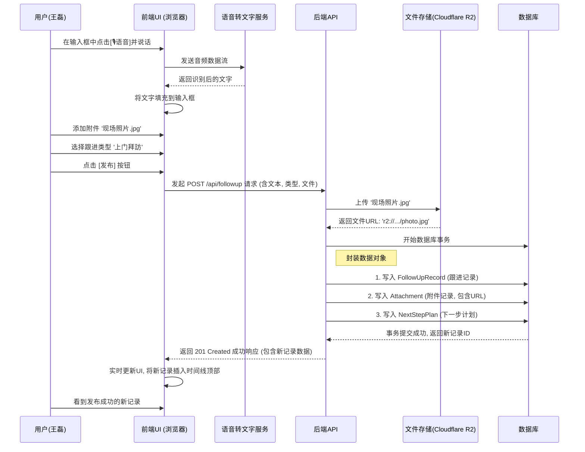

```markdown
# 产品需求文档 (PRD): 智能CRM客户跟进工具 V1.0 (MVP)
- **版本**: 1.0.1 (修订版)
- **状态**: 已确认 (Confirmed)
- **日期**: 2023-10-27

---

## 1. 核心目标与用户画像 (Mission & Persona)

### 1.1 核心目标 (Mission)
通过AI驱动的极致易用工具，将销售从繁琐的客户跟进记录中解放出来，让他们聚焦于建立客户关系和赢取订单。

### 1.2 用户画像 (Persona)
- **销售经理 - 王磊 (30岁)**
- **核心痛点**: 信息过载，客户沟通细节分散在多处（微信、邮件、便签），导致跟进混乱，准备不足；手动整理汇报材料耗时且不准确。

---

## 2. 产品路线图 (Product Roadmap)

### 2.1 V1: 最小可行产品 (MVP) - “快记录、清历史、智能办”
*   **1. 客户跟进记录 (核心)**
    *   **1.1 语音转文字录入**: 支持按住说话，自动将语音实时转为文字，填充到跟进内容中。
    *   **1.2 附件与图片上传**: 支持上传与跟进相关的图片和常见文档附件。
    *   **1.3 引导式文本输入**: 基础的多行文本输入框，内置引导性占位符文本。
*   **2. 结构化跟进信息**
    *   **2.1 跟进类型选择**: 提供固定的、不可修改的跟进类型选项（如: `电话沟通`, `线上会议`, `上门拜访`, `商务宴请`）。
*   **3. 下一步行动 (Next Step)**
    *   **3.1 设置下次跟进**: 提供日期选择器和简单的备注框，用于设定下一次跟进计划。
    *   **3.2 待办提醒**: 在系统内形成一个独立的“待办事项”列表页；并在跟进日期当天或前一天，通过浏览器推送进行提醒。
*   **4. 客户时间轴 (Timeline View)**
    *   在客户详情页，以时间倒序列表清晰展示所有历史跟进记录，包括类型、时间、内容、附件缩略图和当时设定的“下一步计划”。

### 2.2 V2 及以后版本 (Future Releases)
*   **V1.1 - 效率增强包**
    *   **自定义标签系统**: 引入标签功能，支持对跟进记录进行多维度标记，并支持按标签筛选。
    *   **跟进记录模板**: 推出可自定义的跟进记录模板，满足不同销售团队的规范化需求。
*   **V1.2 - AI 助理**
    *   **AI自动纪要生成**: 记录“上门拜访”后，一键调用AI，根据录入的要点自动生成一份结构化的拜访纪要初稿。
    *   **AI决策支持**: 分析客户全部历史记录，在下一次跟进前，自动提炼“沟通要点建议”和“潜在的客户疑虑”。
*   **V2.0 - 平台集成与团队协作**
    *   **深度集成**: 与企业微信、钉钉等办公平台深度集成，实现提醒的无缝推送和部分操作的快捷完成。
    *   **团队视图与报表**: 增加团队管理视角，管理者可以查看团队成员的跟进动态，并自动生成数据报表。

### 2.3 关键业务逻辑 (Business Rules)
1.  每一条跟进记录必须关联一个客户。
2.  语音录入后，系统只保存转换后的文字，为保护隐私，不存储原始语音文件。
3.  “下一步行动”为非必填项，但系统会通过UI设计鼓励用户填写。
4.  所有上传的附件都与对应的跟进记录强绑定，不可分离。

### 2.4 数据契约 (Data Contract)
*   **User**: `user_id`, `name`, `role`
*   **Customer**: `customer_id`, `name`, `company_info`
*   **FollowUpRecord**: `record_id`, `customer_id`, `user_id`, `follow_up_type` (Enum: PHONE_CALL, MEETING, VISIT...), `content` (Text), `created_at`
*   **Attachment**: `attachment_id`, `record_id`, `file_name`, `file_url`, `file_type`
*   **NextStepPlan**: `plan_id`, `record_id`, `due_date`, `notes`, `status` (Enum: PENDING, DONE)

---

## 3. MVP 概念原型与设计说明

### 3.1 选定原型：理念三 - 对话流式 (The Conversational & Inline)

```ascii
+------------------------------------------------------+
| < 返回 | 上海远洋物流 - 李总                        |
+------------------------------------------------------+
|                                                      |
|  +------------------------------------------------+  |
|  | [今天拜访了李总，聊得不错... ]                 |  |
|  |                                                |  |
|  | [电话] [会议] [拜访] [宴请]                      |  |
|  | [🎙️语音] [📎附件] [📅下一步]      [   发布   ]  |  |
|  +------------------------------------------------+  |
|                                                      |
|  --- 时间线 ---------------------------------------   |
|                                                      |
|  ▼ 2023-10-27 by 王磊                               |
|    [上门拜访] 与李总就Q4报价达成初步共识...          |
|    └─ 附件: 现场照片.jpg                           |
|    └─ 下一步计划 (11-05): 准备详细报价单            |
|                                                      |
|  ▼ 2023-10-20 by 王磊                               |
|    [电话沟通] 初步沟通，介绍了我们的优势...          |
|                                                      |
+------------------------------------------------------+

```

### 3.2 设计说明

- **设计哲学**: 此设计将每一次跟进都视为一次“对话”或“状态更新”。输入框直接内联在时间线的顶部，就像发朋友圈或微博一样。用户可以直接在时间线上方完成所有操作，沉浸感最强。
- **优点**: 操作路径最短，用户始终停留在客户时间线的上下文中进行操作，体验流畅自然，最符合销售人员高频、快速记录的工作习惯。
- **侧重**: 沉浸感与上下文关联。

---

## 4. MVP 架构设计蓝图 (Architecture Design Blueprint)

### 4.1 核心流程图



### 4.2 组件交互说明

**将受影响的现有模块：**

- `src/pages/CustomerDetailPage.js`: 包含新增的 `InlineFollowUpInput` 组件，并负责在接收到新记录后刷新 `TimelineView`。
- `src/components/TimelineView.js`: 负责渲染历史跟进记录列表，并具备动态插入新记录的能力。

**需要新增的核心模块：**

- `src/components/InlineFollowUpInput.js`: 核心新增UI组件，负责实现内联输入框的所有功能，并与后端API交互。
- `backend/controllers/followUpController.js`: 核心新增后端逻辑，处理创建新跟进记录的请求，包括文件上传和数据库写入。

### 4.3 技术选型与风险

1. **语音转文字 (Speech-to-Text)**:
    - **选型**: MVP阶段采用浏览器原生的 `Web Speech API`。
    - **理由**: 零成本，前端快速实现。
    - **风险**: 浏览器兼容性问题和嘈杂环境下的准确率问题。需引导用户使用Chrome，并计划在后续版本集成专业云服务。
2. **文件存储 (File Storage)**:
    - **选型**: **Cloudflare R2** (首选), 备选 AWS S3 / 阿里云 OSS。
    - **理由**:
        - **极致成本效益**: R2提供慷慨的免费额度且无出口费用，完美契合MVP阶段的成本控制需求。
        - **低迁移风险**: 提供S3兼容API，开发体验平滑，未来若需迁移至其他云厂商，代码改动极小。
        - **高性能**: 依托Cloudflare的全球网络，文件访问速度快，能提升用户体验。
    - **风险**:
        - **生态成熟度**: R2相对S3较新，周边工具链和特定高级功能的支持可能不如S3全面，但这对于MVP的核心“上传/下载”功能没有影响。
        - **安全配置风险**: 同样需要谨慎配置存储桶权限，确保数据安全，通过后端生成签名URL进行访问。
3. **潜在的技术风险**:
    - **前端性能风险**: 随着历史记录增多，需采用“虚拟列表”或“无限滚动加载”技术，避免一次性渲染大量DOM导致页面卡顿。
